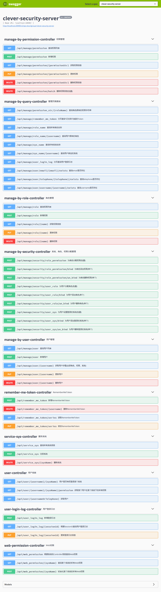
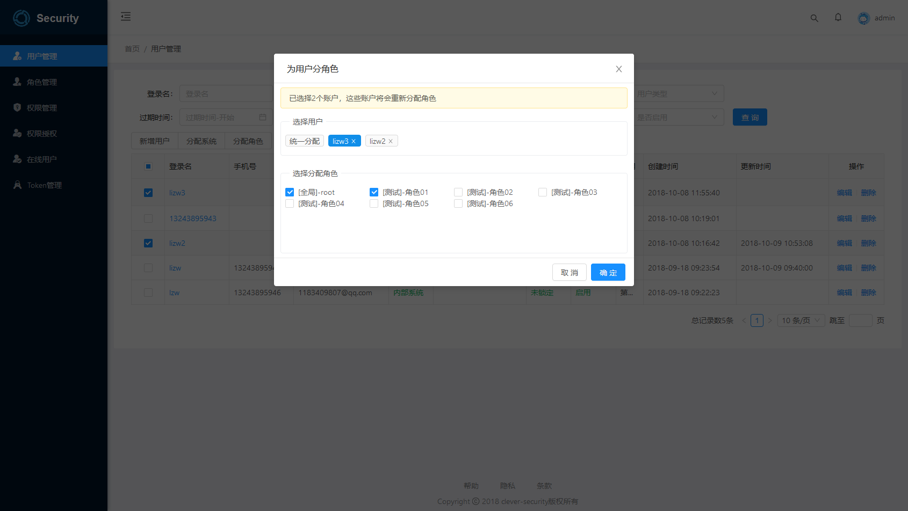
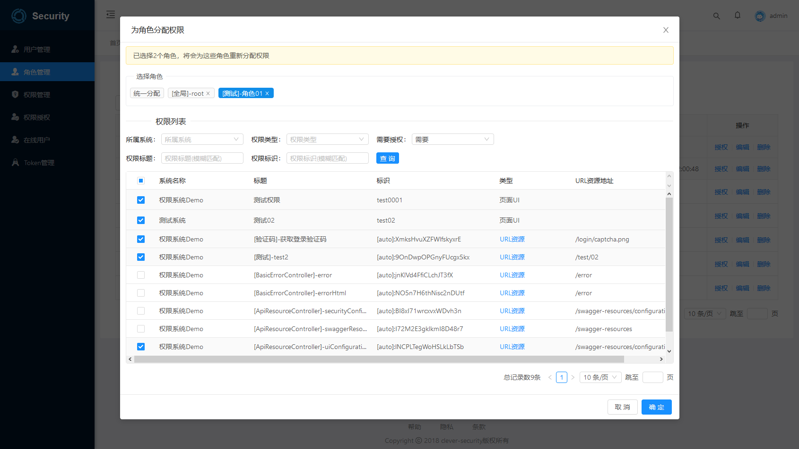
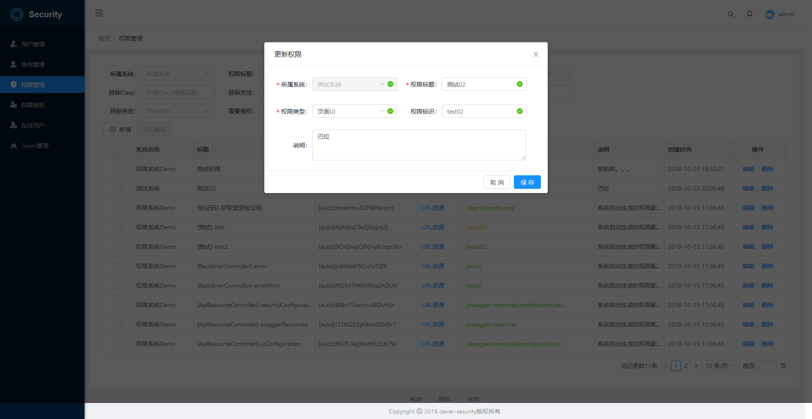
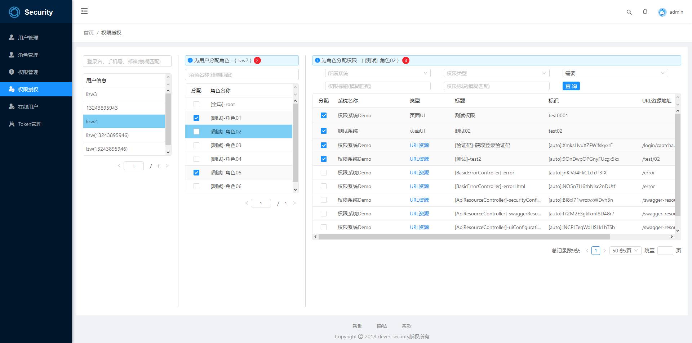

# 多系统权限管理解决方案 clever-security

clever-security是一个多系统的权限管理方案，主要解决两个问题：“用户认证”、“权限授权”，基于SpringBoot开发整合SpringSecurity和SpringSession，仅依赖mysql和redis。支持全局Session和分布式部署。

### 计划支持功能

- [x] 权限系统
    - [x] 服务端支持集群多节点部署
    - [x] 提供易于使用的clever-security-embed包引入即可拥有所有功能
    - [x] 高度可定制化配置
    - [x] 完善的管理后台
    - [x] 全局Session
        - [x] 登录、登出
    - [x] 权限管理
        - [x] 自动生成权限信息(智能更新权限信息)
        - [x] 动态授权实时生效
        - [ ] 支持基于菜单的授权
    - [x] 查看管理在线用户(强行下线)
    - [ ] 支持JWT授权认证方式
    - [ ] CAS单点登录
        - [ ] CAS服务端
        - [ ] CAS客户端
    - [ ] OAuth2.0授权登录
        - [ ] OAuth2.0服务端
        - [ ] OAuth2.0客户端
            - [ ] 微信、QQ、微博、淘宝、京东、钉钉、阿里云、GitHub、Gitee、CSND、WindowsLive
    - [ ] 扫码登录

    - [ ] 支持用户注册(手机号、邮箱、使用OAuth2.0快速注册)
    - [ ] 用户重置密码流程
    - [ ] 用户[绑定/解绑/换绑]手机、邮箱

### 系统截图

